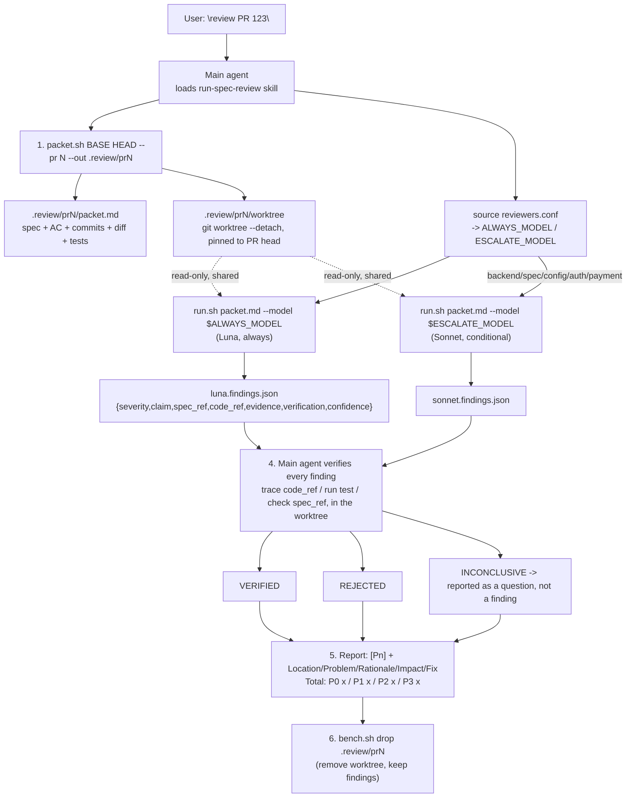

# End-to-end flow



## Files behind each step

| Step | File |
|---|---|
| Orchestration (steps 0, 2, 4, 5, 6) | `skills/run-spec-review/SKILL.md` |
| Reviewer contract (loaded into the reviewer only) | `skills/spec-review/SKILL.md`, `system.md` |
| Build packet + pinned worktree | `skills/spec-review/scripts/packet.sh` |
| Run one reviewer, extract findings + usage | `skills/spec-review/scripts/run.sh` |
| Model selection (single source of truth) | `skills/spec-review/scripts/reviewers.conf` |
| Archive / teardown | `skills/spec-review/scripts/bench.sh` |

## One review, concretely

```bash
S=~/.pi/agent/skills/spec-review/scripts
c=$(gh pr view 123 --json mergeCommit -q .mergeCommit.oid)
$S/packet.sh "$c~1" "$c" --pr 123 --out .review/pr123          # -> packet.md + pinned worktree

set -a; source "$S/reviewers.conf"; set +a
$S/run.sh .review/pr123/packet.md --model "$ALWAYS_MODEL" &     # Luna, always
$S/run.sh .review/pr123/packet.md --model "$ESCALATE_MODEL" &   # Sonnet, only for backend/spec'd PRs
wait

# Main agent verifies every finding inside .review/pr123/worktree, then reports.
$S/bench.sh drop .review/pr123
```

## Design decisions and the evidence behind them

| Decision | Why (see `benchmark.md` for the numbers) |
|---|---|
| Reviewer gets `read/grep/find/ls` only, never bash/edit/write | Reviewer is a proposer, not a judge; a hallucinated finding cannot touch the repo |
| Worktree must be pinned to the PR head | Reading the current checkout missed a shipped production bug in 12/12 runs; pinned, 3/3 models found it |
| Luna always runs, Sonnet only conditionally, Gemini removed | Both remaining models hit 1.00 precision with 86% combined recall of known defects; Gemini scored 0 findings across 5 of the sampled PRs and hallucinated once |
| Model ids live only in `reviewers.conf` | Swapping a model is a one-line diff, not a hunt through skill prose and README examples |
| Verification is always the main agent, never model-vs-model arbitration | Avoids "3 models = 9 hallucinations"; cost sits in verification, not in a review debate |

## Deliberately out of scope for V1

Herdr orchestration, a numeric risk-score router, feeding real `--test-cmd` output into the packet, and binding reviewer selection into `omp config` model routing. Reasoning for each is in `benchmark.md` §6.
